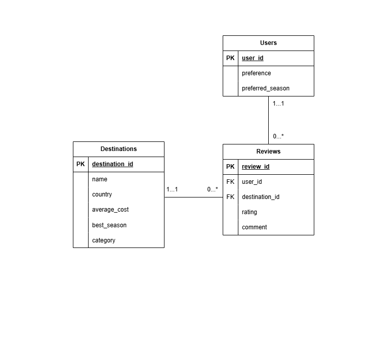

## Travel-Insights-Platform （SQL + Python)
A data-driven travel insights platform built using SQL + Python. 
This project demonstrates end-to-end data workflow including ERD diagram, data modeling, and analytical querying to generate meaningful travel recommendations.

## Project Overview
This project simulates a real-world travel platform where users can explore destinations, leave reviews, and receive personalized travel recommendations.

It is designed to showcase:
- Relational database design (ERD)
- SQL querying and data analysis
- Basic recommendation logic
- Integration with Python for data handling

## Database Design

The system consists of three main entities:

- **Users**: Stores user preferences and travel seasons
- **Destinations**: Stores travel location details
- **Reviews**: Stores user ratings and feedback

Relationships:
- One user → many reviews
- One destination → many reviews

## ER Diagram:  


## Tech Stack
- **Python** (sqlite3, pandas - optional)
- **SQLite** (Relational Database)
- **SQL** (Data querying & analysis)
- **StarUML** (ER Diagram design)
- **Jupyter Notebook / Google Colab**

## Features
- Structured relational database design  
- SQL queries for data analysis  
- Review-based rating system  
- Budget & seasonal travel filtering  
- Basic recommendation logic  

## Database Schema

### Destinations
- destination_id (PK)
- name
- country
- average_cost
- best_season
- category

### Users
- user_id (PK)
- preference
- preferred_season

### Reviews
- review_id (PK)
- user_id (FK)
- destination_id (FK)
- rating
- comment

## 📈 Example SQL Queries

### 🔍 Cheapest Destinations
```sql
SELECT name, country, average_cost
FROM destinations
ORDER BY average_cost ASC;
